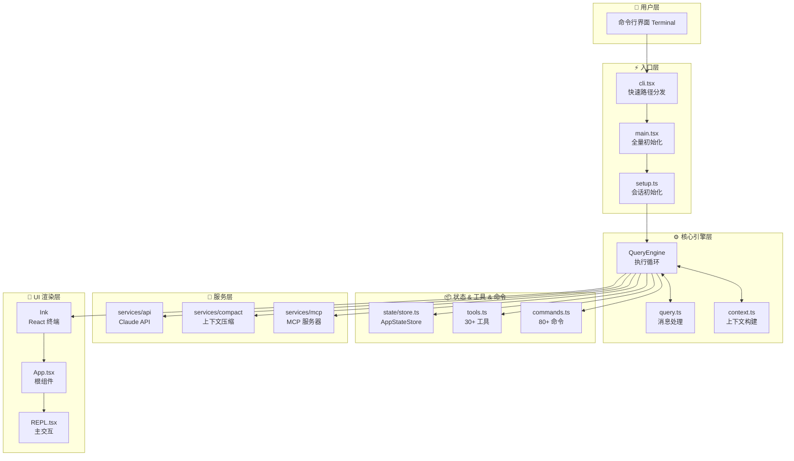
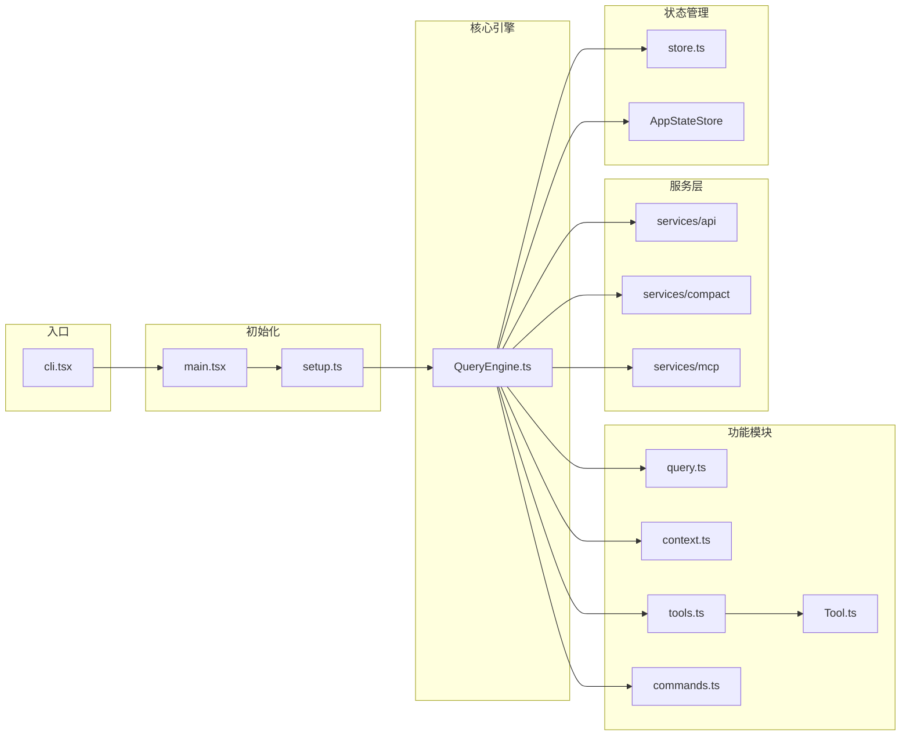
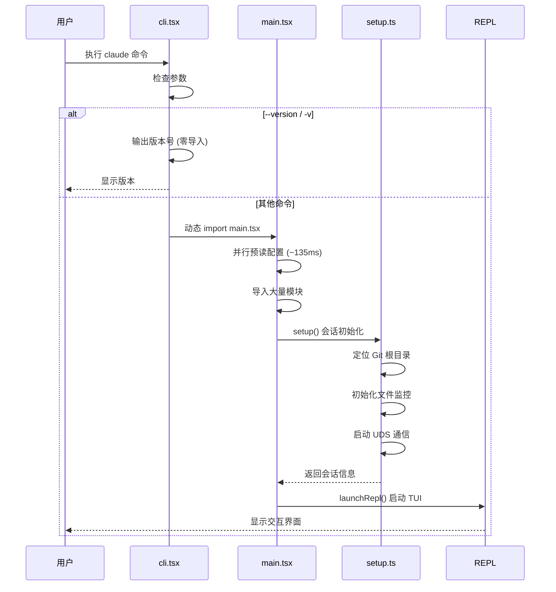
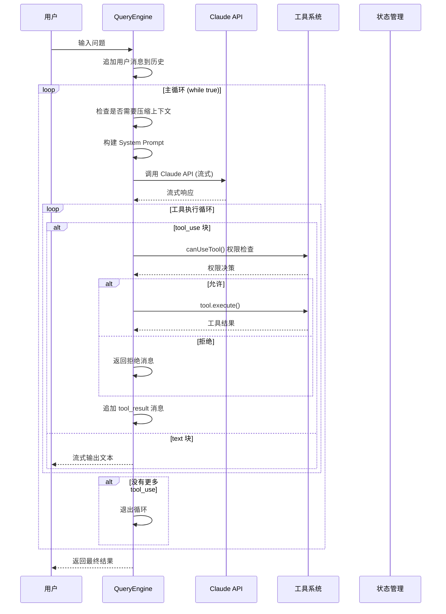
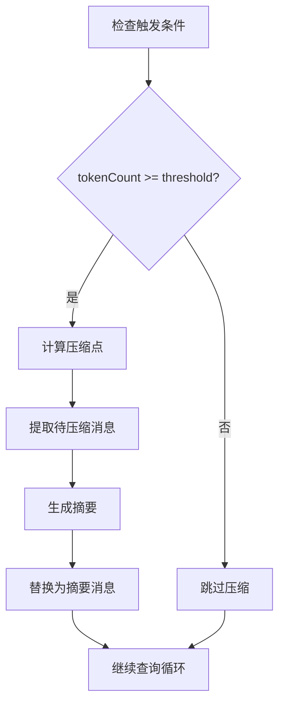
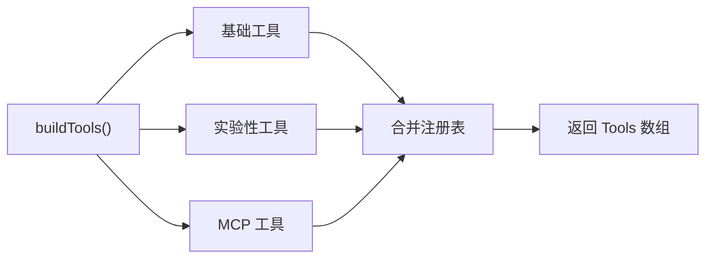
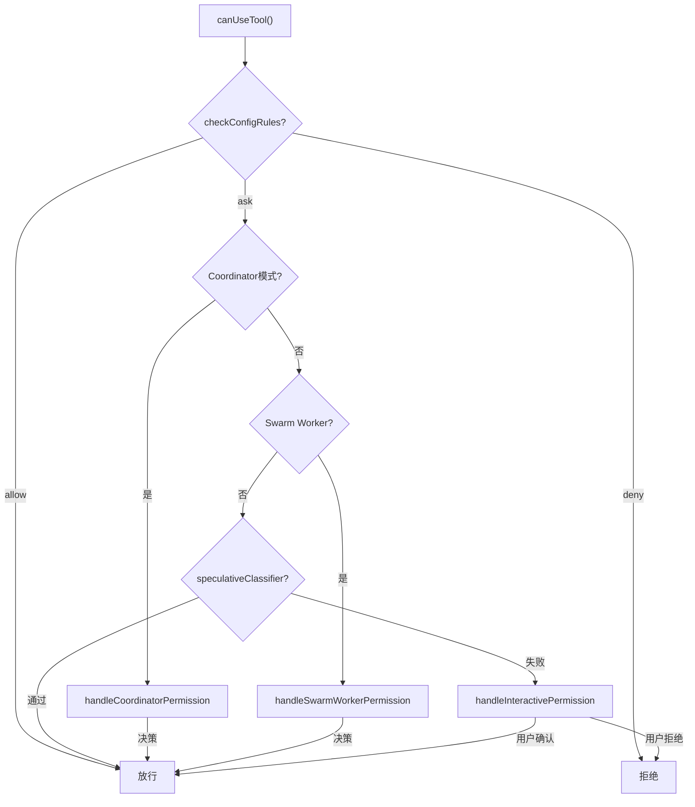
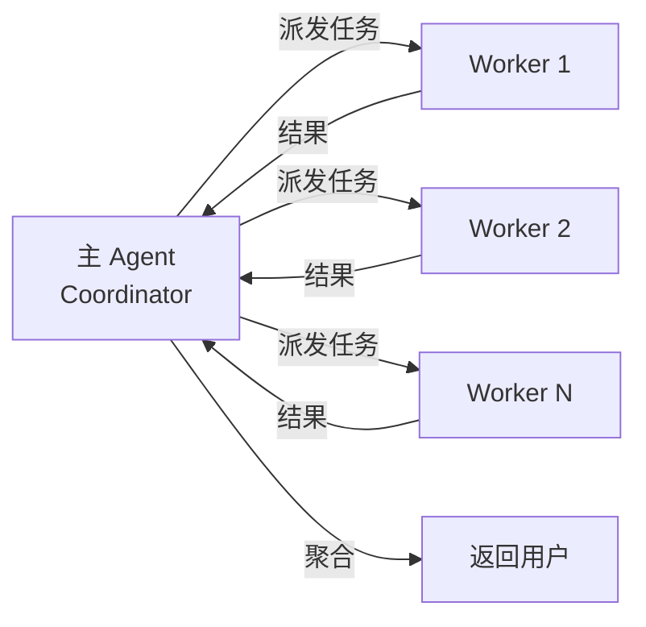

# Claude Code 代码库架构分析报告

> 分析日期：2026-03-31
> 源码目录：restored-src/src
> 目标：让新人能照此文档复刻一个完整的 Claude Code

---

## 目录

1. [整体架构](#1-整体架构)
2. [核心技术栈](#2-核心技术栈)
3. [用户交互完整流程](#3-用户交互完整流程)
4. [Agent 工程化](#4-agent-工程化)
5. [扩展机制](#5-扩展机制)
6. [其他工程经验](#6-其他工程经验)

---

## 1. 整体架构

### 1.1 分层架构图（Mermaid）



### 1.2 模块依赖关系（Mermaid）



### 1.3 目录结构

```
src/
├── entrypoints/              # 程序入口点
│   ├── cli.tsx              # CLI 快速路径分发
│   ├── main.tsx             # 主程序全量初始化
│   └── init.ts             # 初始化函数
│
├── bootstrap/               # 启动状态
│   └── state.ts            # 全局单例状态
│
├── coordinator/             # 协调模式
│   └── coordinatorMode.ts  # 多 Agent 协调
│
├── query/                   # 查询引擎子模块
│   ├── deps.ts             # 依赖注入
│   ├── config.ts           # 配置构建
│   └── transitions.ts       # 状态转换
│
├── commands/                # 命令系统 (80+)
│   └── commands.ts         # 命令注册表
│
├── tools/                  # 工具系统 (30+)
│   ├── tools.ts            # 工具注册表
│   ├── Tool.ts            # 工具基类
│   ├── BashTool/          # Bash 工具
│   ├── AgentTool/         # Agent 派发工具
│   └── ...
│
├── state/                  # 状态管理
│   ├── store.ts           # 极简响应式 Store (~30行)
│   └── AppStateStore.ts    # React 状态类型
│
├── context/                # React Context
│   ├── mailbox.tsx        # 进程间消息
│   └── notifications.tsx  # 通知队列
│
├── components/             # UI 组件 (80+)
│   ├── App.tsx           # React 根组件
│   └── ...
│
├── screens/                # 顶层屏幕
│   └── REPL.tsx          # 主交互界面 (4926 行)
│
├── services/              # 后台服务
│   ├── api/              # Claude API 调用
│   ├── compact/          # 上下文压缩
│   └── mcp/              # MCP 服务器管理
│
└── hooks/                # React Hooks
    └── useCanUseTool.tsx # 权限判断核心
```

---

## 2. 核心技术栈

### 2.1 技术选型

| 类别 | 技术 | 用途 |
|------|------|------|
| **运行时** | Bun | 启动速度比 Node 快 |
| **UI** | Ink | React 的终端实现，用 React 写 TUI |
| **状态** | 自研 Pub/Sub Store | 约 30 行，比 Redux 简洁 |
| **CLI** | Commander.js | 命令行参数解析 |
| **API** | Anthropic Claude API | LLM 调用 |
| **协议** | MCP (Model Context Protocol) | 工具服务器协议 |
| **类型** | TypeScript + Zod | 端到端类型安全 |

### 2.2 关键库

```json
{
  "dependencies": {
    "@anthropic-ai/sdk": "^0.40.0",
    "@modelcontextprotocol/sdk": "^0.5.0",
    "ink": "^5.0.0",
    "react": "^18.0.0",
    "commander": "^12.0.0",
    "zod": "^3.23.0",
    "lodash-es": "^4.17.0"
  }
}
```

### 2.3 Feature Flag + DCE

Bun 特有的编译时消除机制：

```typescript
import { feature } from 'bun:bundle'

// 编译时内联检查，启用则包含代码，否则完全消除
if (feature('COORDINATOR_MODE')) {
  // 只有开启 COORDINATOR_MODE 编译标志才会包含这段代码
}

// 常用 Flags
const COORDINATOR_MODE = feature('COORDINATOR_MODE')  // 多 Agent 协调
const KAIROS = feature('KAIROS')                     // 助手模式
const VOICE_MODE = feature('VOICE_MODE')              // 语音模式
const BG_SESSIONS = feature('BG_SESSIONS')            // 后台会话
```

---

## 3. 用户交互完整流程

### 3.1 启动流程时序图（Mermaid）



### 3.2 查询执行流程时序图（Mermaid）



### 3.3 核心代码

**cli.tsx 快速路径**：

```typescript
// src/entrypoints/cli.tsx
async function main(): Promise<void> {
  const args = process.argv.slice(2);

  // ⚡ 快速路径：--version 零导入
  if (args.length === 1 && (args[0] === '--version' || args[0] === '-v')) {
    console.log(`${MACRO.VERSION} (Claude Code)`);
    return;
  }

  // 其他命令才加载完整模块
  const { cliMain } = await import('./main.js');
  return cliMain();
}
```

**query.ts 核心循环**：

```typescript
// src/query.ts
export async function* query(params: QueryParams): AsyncGenerator<...> {
  const terminal = yield* queryLoop(params, consumedCommandUuids);
  return terminal;
}

async function* queryLoop(params: QueryParams, ...): AsyncGenerator<...> {
  while (true) {
    // 1. 检查压缩
    if (shouldCompact(params.messages)) {
      yield* compactMessages(params);
    }

    // 2. 构建请求
    const systemPrompt = buildSystemPrompt(params);

    // 3. 调用 API
    const stream = await callClaudeAPI(systemPrompt, params.messages);

    // 4. 处理响应
    for await (const event of stream) {
      if (event.toolUse) {
        yield* handleToolUse(event.toolUse);
      }
      yield event;
    }

    // 5. 检查完成
    if (isComplete(response)) break;
  }
}
```

---

## 4. Agent 工程化

### 4.1 核心循环实现

**QueryEngine 是 Agent 的心脏**：

```typescript
export class QueryEngine {
  private tools: Tools;
  private messages: Message[] = [];
  private context: ToolUseContext;

  async *handleNextMessage(userInput: string): AsyncGenerator<Message | StreamEvent> {
    // 1. 追加用户消息
    this.messages.push(createUserMessage(userInput));

    // 2. 主循环
    while (true) {
      const response = await this.callAPI(this.buildRequest());

      for (const block of response.content) {
        if (block.type === 'tool_use') {
          const result = await this.executeTool(block);
          this.messages.push(createToolResult(block.id, result));
        } else if (block.type === 'text') {
          yield createAssistantMessage(block.text);
        }
      }

      if (!response.hasMore) break;
    }
  }
}
```

### 4.2 提示词工程

**System Prompt 构建**：

```typescript
export function buildSystemPrompt(params: QueryParams): SystemPrompt {
  const sections: string[] = [];

  // 1. 核心指令
  sections.push(`你是一个 AI 编程助手，名为 Claude Code。`);

  // 2. 可用工具
  sections.push(`## 可用工具
${params.tools.map(t => `- ${t.name}: ${t.description}`).join('\n')}`);

  // 3. 工作目录规则
  sections.push(`## 工作目录规则
- 只在项目根目录下操作`);

  // 4. 安全规则
  sections.push(`## 安全规则
- 删除文件前确认
- 危险操作需要用户确认`);

  return sections.join('\n\n');
}
```

### 4.3 上下文压缩

**Compact 流程图（Mermaid）**：



**压缩算法**：

```typescript
export async function compactMessages(params: QueryParams): Promise<void> {
  const compactPoint = findCompactPoint(params.messages);
  const messagesToCompact = params.messages.slice(0, compactPoint);

  // 调用 LLM 生成摘要
  const summary = await generateSummary(messagesToCompact);

  // 替换为摘要消息
  params.messages = [
    createSummaryMessage(summary),
    ...params.messages.slice(compactPoint),
  ];
}
```

---

## 5. 扩展机制

### 5.1 工具系统架构

**工具注册流程图（Mermaid）**：



**工具基类**：

```typescript
// src/Tool.ts
export type Tool<Input, Output, P> = {
  // 核心方法
  call(args, context, canUseTool, parentMessage, onProgress?): Promise<ToolResult<Output>>
  description(args, options): Promise<string>

  // 必填属性
  readonly name: string
  readonly inputSchema: Input
  readonly maxResultSizeChars: number

  // 可选方法（有默认值）
  isEnabled(): boolean
  isConcurrencySafe(input): boolean
  isReadOnly(input): boolean
}

// 工具工厂函数
const TOOL_DEFAULTS = {
  isEnabled: () => true,
  isConcurrencySafe: () => false,
  isReadOnly: () => false,
};

export function buildTool<D extends ToolDef>(def: D): Tool {
  return { ...TOOL_DEFAULTS, userFacingName: () => def.name, ...def };
}
```

**自定义工具示例**：

```typescript
export const HelloWorldTool = buildTool({
  name: 'hello_world',
  description: '打印 Hello World',

  inputSchema: z.object({
    name: z.string().optional().describe('要问候的名字'),
  }),

  async call(args, context) {
    return {
      data: { message: `Hello, ${args.name || 'World'}!` },
    };
  },
});
```

### 5.2 命令系统架构

**命令解析流程图（Mermaid）**：

```mermaid
flowchart TD
    A["用户输入"] --> B{以 / 开头?"}
    B -->|是| C["解析斜杠命令"]
    B -->|否| E["作为普通消息处理"]
    C --> D["查找命令"]
    D --> F{"找到?"}
    F -->|是| G["执行命令"]
    F -->|否| H["提示未知命令"]
```

**命令注册**：

```typescript
export async function getCommands(): Promise<Command[]> {
  return [
    new HelpCommand(),
    new ExitCommand(),
    new ModelCommand(),
    new PermissionsCommand(),
  ];
}

export function parseSlashCommand(input: string): { command: string; args: string } | null {
  const match = input.match(/^\/(\w+)(?:\s+(.*))?$/);
  return match ? { command: match[1], args: match[2] || '' } : null;
}
```

### 5.3 Hook 系统架构

**权限决策流程图（Mermaid）**：



---

## 6. 其他工程经验

### 6.1 极简响应式 Store

**约 30 行的完整实现**：

```typescript
// src/state/store.ts
type Listener = () => void;

export function createStore<T>(initialState: T, onChange?) {
  let state = initialState;
  const listeners = new Set<Listener>();  // Set 自动去重

  return {
    getState: () => state,

    setState: (updater) => {
      const prev = state;
      const next = updater(prev);
      if (Object.is(next, prev)) return;  // 新旧相同则跳过
      state = next;
      onChange?.({ newState: next, oldState: prev });
      for (const listener of listeners) listener();
    },

    subscribe: (listener) => {
      listeners.add(listener);
      return () => listeners.delete(listener);  // 返回取消订阅
    },
  };
}
```

**借鉴意义**：
- `Object.is()` 检查避免无效渲染
- `Set` 存储 listeners 自动去重
- 返回取消订阅函数，内存安全
- 约 30 行 vs Redux 100+ 行

### 6.2 依赖注入

```typescript
// src/query/deps.ts
export type QueryDeps = {
  callClaudeAPI: typeof callClaudeAPI;
  tools: Tools;
  canUseTool: CanUseToolFn;
  compact: typeof compactMessages;
};

export async function* query(params: QueryParams): AsyncGenerator<...> {
  const deps = params.deps ?? productionDeps;  // 默认生产依赖
  const response = await deps.callClaudeAPI(request);
}
```

### 6.3 Coordinator 模式

**多 Agent 协调**：



```typescript
export function isCoordinatorMode(): boolean {
  if (feature('COORDINATOR_MODE')) {
    return isEnvTruthy(process.env.CLAUCE_CODE_COORDINATOR_MODE);
  }
  return false;
}
```

---

## 7. 核心模块深度分析

### 7.1 query.ts 核心循环

#### query() 函数的完整实现

`query()` 是整个 Agent 循环的入口点，返回一个 `AsyncGenerator`：

```typescript
export async function* query(
  params: QueryParams,
): AsyncGenerator<
  | StreamEvent
  | RequestStartEvent
  | Message
  | TombstoneMessage
  | ToolUseSummaryMessage,
  Terminal
> {
  const consumedCommandUuids: string[] = []
  const terminal = yield* queryLoop(params, consumedCommandUuids)
  for (const uuid of consumedCommandUuids) {
    notifyCommandLifecycle(uuid, 'completed')
  }
  return terminal
}
```

**关键设计点：**
- `yield* queryLoop()` — 使用 **yield* 委托机制**
- `consumedCommandUuids` — 追踪本轮消耗的命令 UUID
- 返回值是 `Terminal` 类型，标识循环退出原因

#### queryLoop() 的 while 循环逻辑

```typescript
async function* queryLoop(params: QueryParams, consumedCommandUuids: string[]): AsyncGenerator<...> {
  // 不可变参数
  const { systemPrompt, userContext, systemContext, canUseTool, ... } = params

  // 可变跨迭代状态
  let state: State = {
    messages: params.messages,
    toolUseContext: params.toolUseContext,
    autoCompactTracking: undefined,
    maxOutputTokensRecoveryCount: 0,
    turnCount: 1,
    pendingToolUseSummary: undefined,
  }

  while (true) {
    // 1. 前处理：snip、microcompact、autocompact
    // 2. 调用 API：deps.callModel()
    // 3. 工具执行：runTools() 或 streamingToolExecutor
    // 4. 状态更新 + continue / return
  }
}
```

**循环退出路径：**
1. `{ reason: 'completed' }` — 正常完成
2. `{ reason: 'aborted_streaming' }` — 用户中断
3. `{ reason: 'prompt_too_long' }` — 上下文超限
4. `{ reason: 'max_turns', turnCount }` — 达到最大轮数

#### AsyncGenerator 的 yield* 委托机制

```typescript
// query() 中
const terminal = yield* queryLoop(params, consumedCommandUuids)
// 等价于:
// for await (const item of queryLoop(params)) { yield item }
// return queryLoop.return()
```

`yield*` 的关键语义：
- 将 Generator 控制权委托给另一个 Generator
- 委托方产生的所有值直接 yield 给上层调用者
- 委托方 return 的值作为 `yield*` 表达式的结果

#### 错误恢复机制

```typescript
// 1. 模型降级
if (innerError instanceof FallbackTriggeredError && fallbackModel) {
  currentModel = fallbackModel
  continue // 重试
}

// 2. max_output_tokens 恢复
if (isWithheldMaxOutputTokens(lastMessage)) {
  if (maxOutputTokensRecoveryCount < MAX_OUTPUT_TOKENS_RECOVERY_LIMIT) {
    state = { ...state, transition: { reason: 'max_output_tokens_recovery' } }
    continue
  }
}

// 3. prompt_too_long 恢复（先尝试 collapse，再尝试 reactive compact）
```

---

### 7.2 Tool.ts 工具基类

#### Tool 类型的完整定义

```typescript
export type Tool<Input, Output, P> = {
  // 核心方法
  call(args, context, canUseTool, parentMessage, onProgress?): Promise<ToolResult<Output>>
  description(args, options): Promise<string>

  // 必填属性
  readonly name: string
  readonly inputSchema: Input
  readonly maxResultSizeChars: number

  // 行为特性
  isConcurrencySafe(input): boolean
  isReadOnly(input): boolean
  isDestructive?(input): boolean

  // UI 渲染
  renderToolUseMessage(input, options): React.ReactNode
  renderToolResultMessage?(content, options): React.ReactNode
}
```

#### buildTool() 工厂函数

```typescript
const TOOL_DEFAULTS = {
  isEnabled: () => true,
  isConcurrencySafe: () => false,  // 默认不安全
  isReadOnly: () => false,        // 默认有写入
  isDestructive: () => false,
  checkPermissions: () => ({ behavior: 'allow' }),
  toAutoClassifierInput: () => '',  // 默认跳过分类器
};

export function buildTool<D extends ToolDef>(def: D): Tool {
  return { ...TOOL_DEFAULTS, userFacingName: () => def.name, ...def };
}
```

---

### 7.3 state/store.ts 极简 Store

```typescript
export function createStore<T>(initialState: T, onChange?) {
  let state = initialState;
  const listeners = new Set<Listener>();

  return {
    getState: () => state,

    setState: (updater) => {
      const prev = state;
      const next = updater(prev);
      if (Object.is(next, prev)) return;  // Object.is 做相等性检查
      state = next;
      onChange?.({ newState: next, oldState: prev });
      for (const listener of listeners) listener();
    },

    subscribe: (listener) => {
      listeners.add(listener);
      return () => listeners.delete(listener);
    },
  };
}
```

**设计亮点：**
- **Set 而非 Array**：自动去重
- **`Object.is()` 短路**：状态未变时不触发更新
- **`onChange` 钩子**：可选的全局变化回调

---

### 7.4 context.ts 上下文构建

**缓存模式**：

```typescript
export const getSystemContext = memoize(async (): Promise<{[k: string]: string}> => {
  const gitStatus = await getGitStatus()
  return { ...(gitStatus && { gitStatus }) }
})

export const getUserContext = memoize(async (): Promise<{[k: string]: string}> => {
  const claudeMd = getClaudeMds()
  return {
    ...(claudeMd && { claudeMd }),
    currentDate: `Today's date is ${getLocalISODate()}.`,
  }
})
```

---

### 7.5 commands.ts 命令系统

**条件编译模式**：

```typescript
const proactive = feature('PROACTIVE') || feature('KAIROS')
  ? require('./commands/proactive.js').default
  : null

const COMMANDS = memoize((): Command[] => [
  addDir, advisor, agents, branch, btw, clear, color, compact, ...
  ...(proactive ? [proactive] : []),
])
```

---

### 7.6 hooks/useCanUseTool.tsx 权限系统

**权限决策流程**：

```
hasPermissionsToUseTool() → PermissionResult
    ├── behavior: 'allow' → 直接放行
    ├── behavior: 'deny' → 记录日志 + 返回拒绝
    └── behavior: 'ask' → 进入交互式流程
                              ├── handleCoordinatorPermission()
                              ├── handleSwarmWorkerPermission()
                              ├── speculativeClassifierCheck() (2s 超时)
                              └── handleInteractivePermission()
```

---

### 7.7 services/compact/ 上下文压缩

**自动压缩触发条件**：

```typescript
export async function shouldAutoCompact(messages, model, ...): Promise<boolean> {
  // 1. 不是 session_memory 或 compact 查询
  if (querySource === 'session_memory') return false

  // 2. 阈值检查
  const tokenCount = tokenCountWithEstimation(messages)
  const threshold = getEffectiveContextWindowSize(model) - 13_000
  return tokenCount >= threshold
}
```

**Circuit Breaker**：

```typescript
const MAX_CONSECUTIVE_AUTOCOMPACT_FAILURES = 3
if (tracking?.consecutiveFailures >= MAX_CONSECUTIVE_AUTOCOMPACT_FAILURES) {
  return { wasCompacted: false } // 停止重试
}
```

---

### 7.8 coordinatorMode.ts 多Agent协调

**Coordinator 模式**：

```typescript
export function isCoordinatorMode(): boolean {
  if (feature('COORDINATOR_MODE')) {
    return isEnvTruthy(process.env.CLAUCE_CODE_COORDINATOR_MODE)
  }
  return false
}
```

**Worker 工具限制**：

```typescript
const workerTools = isEnvTruthy(process.env.CLAUCE_CODE_SIMPLE)
  ? [BASH_TOOL_NAME, FILE_READ_TOOL_NAME, FILE_EDIT_TOOL_NAME]
  : Array.from(ASYNC_AGENT_ALLOWED_TOOLS)
```

---

## 总结

### 核心设计经验

| 经验 | 说明 |
|------|------|
| **快速路径优化** | 零导入 `--version`，动态 `import()` |
| **极简 Store** | 30 行实现响应式，`Object.is` + `Set` |
| **Feature Flag + DCE** | `feature('FLAG')` 编译时消除 |
| **工具插件化** | `Tool` 基类 + `buildTool()` 工厂 |
| **Hook 注入权限** | 权限逻辑可替换，4 层决策流程 |
| **AsyncGenerator 流式** | `yield*` 委托实现流式处理 |
| **依赖注入** | 核心逻辑与实现分离 |
| **Coordinator 模式** | 多 Agent 编排，系统提示协调 |
| **Circuit Breaker** | 连续失败 N 次后停止重试 |
| **上下文压缩** | 自动阈值触发 + circuit breaker |

### 核心原则

1. **性能优先**：快速路径、延迟加载、DCE
2. **简洁**：用最少的代码解决问题（30 行 Store vs 100+ 行 Redux）
3. **可扩展**：插件化、Hook 注入、Feature Flag
4. **可测试**：依赖注入、模块化
