# Claude Code 代码库架构分析报告

> 分析日期：2026-03-31
> 源码目录：restored-src/src
> 目标：让新人能照此文档复刻一个完整的 Claude Code

---

## 目录

1. [整体架构](#1-整体架构)
2. [核心技术栈](#2-核心技术栈)
3. [用户交互完整流程](#3-用户交互完整流程)
4. [Agent 工程化](#4-agent-工程化)
5. [扩展机制详解](#5-扩展机制详解)
6. [多 Agent 架构](#6-多-agent-架构)
7. [核心模块深度分析](#7-核心模块深度分析)
8. [其他工程经验](#8-其他工程经验)

---

## 1. 整体架构

### 1.1 分层架构图（Mermaid）

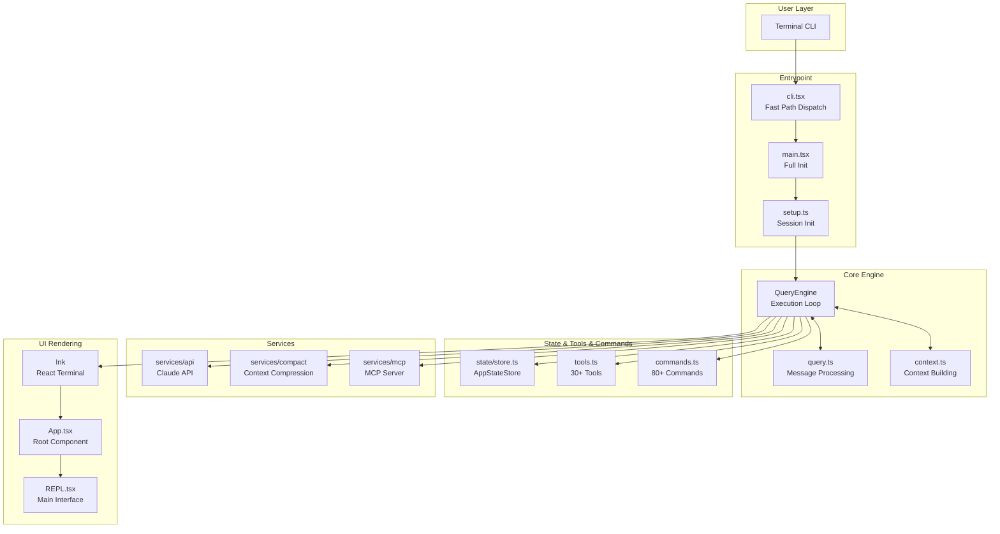

### 1.2 模块依赖关系（Mermaid）

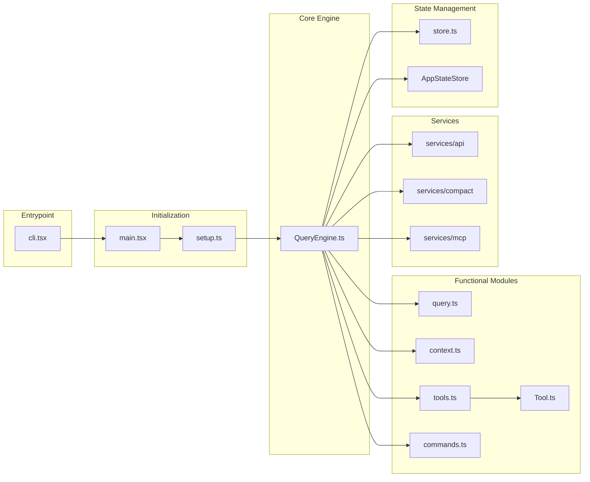

### 1.3 目录结构

```
src/
├── entrypoints/              # Program entrypoints
│   ├── cli.tsx             # CLI fast path dispatch
│   ├── main.tsx            # Main program full init
│   └── init.ts             # Init functions
│
├── bootstrap/              # Bootstrap state
│   └── state.ts           # Global singleton state
│
├── coordinator/           # Coordinator mode
│   └── coordinatorMode.ts  # Multi-Agent coordination
│
├── query/                  # Query engine submodules
│   ├── deps.ts            # Dependency injection
│   └── transitions.ts      # State transitions
│
├── commands/              # Command system (80+)
│   └── commands.ts        # Command registry
│
├── tools/                 # Tool system (40+)
│   ├── tools.ts          # Tool registry
│   ├── Tool.ts          # Tool base class
│   ├── BashTool/        # Bash tool
│   ├── AgentTool/       # Agent dispatch tool
│   └── ...
│
├── state/                # State management
│   ├── store.ts        # Simple reactive Store (~30 lines)
│   └── AppStateStore.ts  # React state types
│
├── context/              # React Context
│   ├── mailbox.tsx     # Inter-process messaging
│   └── notifications.tsx # Notification queue
│
├── components/           # UI components (80+)
│   ├── App.tsx        # React root component
│   └── ...
│
├── screens/              # Top-level screens
│   └── REPL.tsx      # Main interface (4926 lines)
│
├── services/            # Backend services
│   ├── api/           # Claude API calls
│   ├── compact/       # Context compression
│   └── mcp/         # MCP server management
│
└── hooks/            # React Hooks
    └── useCanUseTool.tsx # Permission hook
```

---

## 2. 核心技术栈

### 2.1 技术选型

| Category | Technology | Purpose |
|----------|------------|---------|
| **Runtime** | Bun | Faster startup than Node |
| **UI** | Ink | React for terminal, build TUI with React |
| **State** | Custom Pub/Sub Store | ~30 lines, simpler than Redux |
| **CLI** | Commander.js | CLI argument parsing |
| **API** | Anthropic Claude API | LLM calls |
| **Protocol** | MCP | Model Context Protocol |
| **Type** | TypeScript + Zod | End-to-end type safety |

### 2.2 Feature Flag + DCE

Bun's compile-time dead code elimination:

```typescript
import { feature } from 'bun:bundle'

// Compile-time check, code only included if flag is enabled
if (feature('COORDINATOR_MODE')) {
  // Only included if COORDINATOR_MODE build flag is on
}

// Common Flags
const COORDINATOR_MODE = feature('COORDINATOR_MODE')  // Multi-Agent
const KAIROS = feature('KAIROS')                     // Assistant mode
const VOICE_MODE = feature('VOICE_MODE')              // Voice mode
const BG_SESSIONS = feature('BG_SESSIONS')           // Background sessions
```

---

## 3. 用户交互完整流程

### 3.1 启动流程时序图（Mermaid）

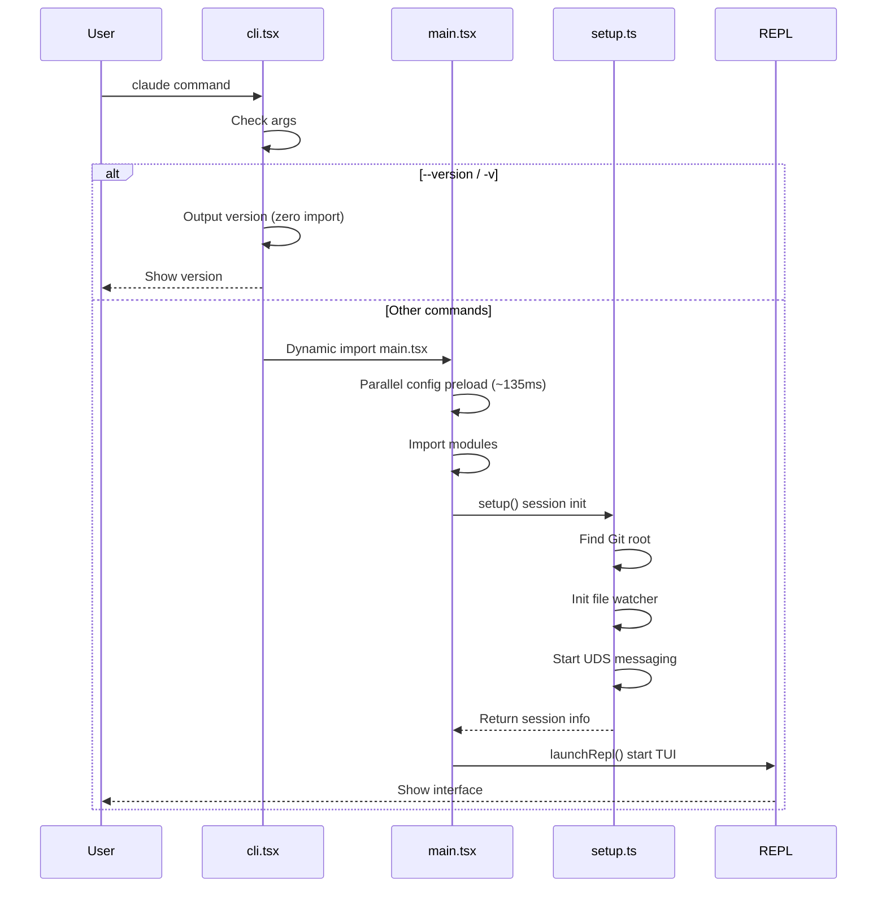

### 3.2 查询执行流程时序图（Mermaid）

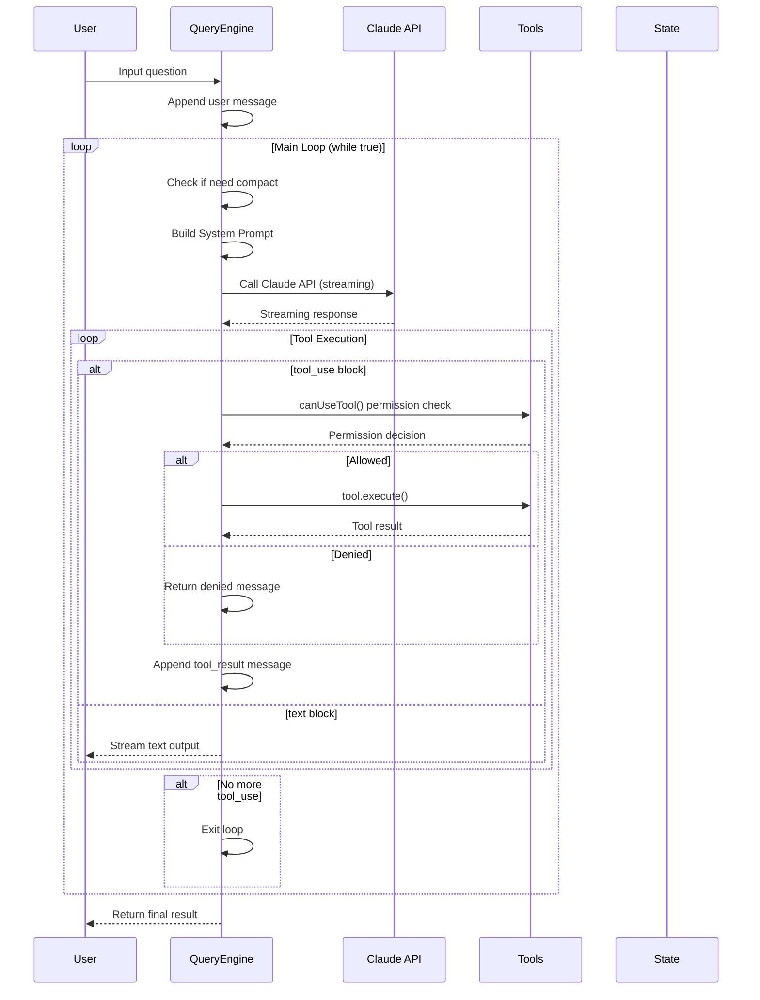

---

## 4. Agent 工程化

### 4.1 核心循环实现

**QueryEngine is the heart of Agent**:

```typescript
export class QueryEngine {
  private tools: Tools;
  private messages: Message[] = [];
  private context: ToolUseContext;

  async *handleNextMessage(userInput: string): AsyncGenerator<Message | StreamEvent> {
    // 1. Append user message
    this.messages.push(createUserMessage(userInput));

    // 2. Main loop
    while (true) {
      const response = await this.callAPI(this.buildRequest());

      for (const block of response.content) {
        if (block.type === 'tool_use') {
          const result = await this.executeTool(block);
          this.messages.push(createToolResult(block.id, result));
        } else if (block.type === 'text') {
          yield createAssistantMessage(block.text);
        }
      }

      if (!response.hasMore) break;
    }
  }
}
```

### 4.2 提示词工程

**System Prompt Building**:

```typescript
export function buildSystemPrompt(params: QueryParams): SystemPrompt {
  const sections: string[] = [];

  // 1. Core instructions
  sections.push(`You are Claude Code, an AI coding assistant.`);

  // 2. Available tools
  sections.push(`## Available Tools
${params.tools.map(t => `- ${t.name}: ${t.description}`).join('\n')}`);

  // 3. Working directory rules
  sections.push(`## Working Directory Rules
- Only operate in project root directory`);

  // 4. Security rules
  sections.push(`## Security Rules
- Confirm before deleting files
- Dangerous operations require user confirmation`);

  return sections.join('\n\n');
}
```

### 4.3 上下文压缩

**Compact Flow** (Mermaid):

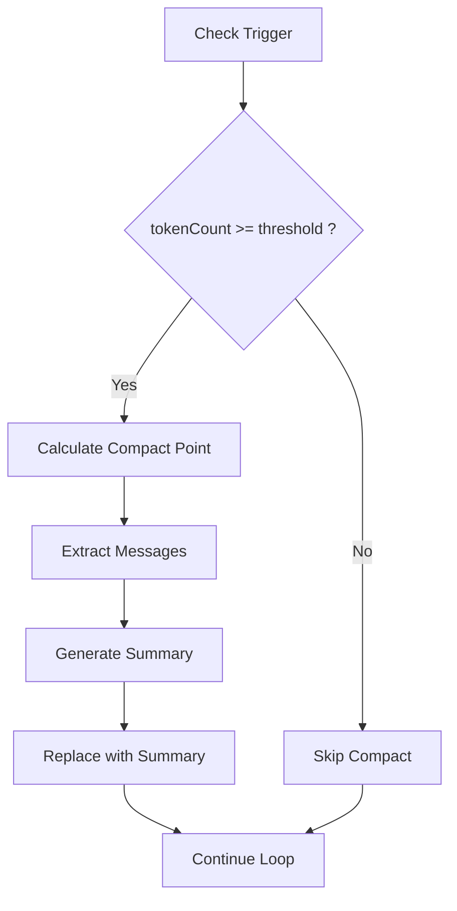

---

## 5. 扩展机制详解

### 5.1 扩展点总览（Mermaid）

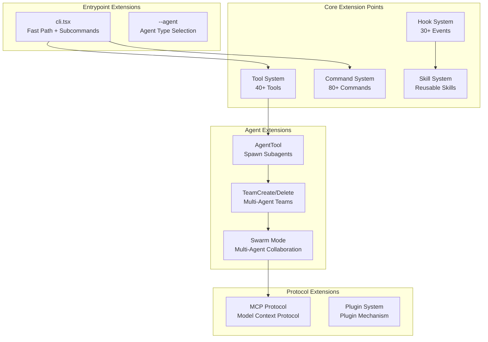

### 5.2 核心数据结构

#### 5.2.1 全局状态 (bootstrap/state.ts)

```typescript
// src/bootstrap/state.ts
type State = {
  // Session identity
  sessionId: SessionId
  parentSessionId: SessionId | undefined
  projectRoot: string
  cwd: string

  // Stats & Cost
  totalCostUSD: number
  totalAPIDuration: number
  totalToolDuration: number
  modelUsage: { [modelName: string]: ModelUsage }

  // Agent related
  agentColorMap: Map<string, AgentColorName>
  mainThreadAgentType: string | undefined

  // Hooks & Skills
  registeredHooks: Partial<Record<HookEvent, RegisteredHookMatcher[]>> | null
  invokedSkills: Map<string, InvokedSkillInfo>

  // Team & Collaboration
  sessionCreatedTeams: Set<string>
  teamContext: TeamContext | undefined

  // Time tracking
  startTime: number
  lastInteractionTime: number
}
```

#### 5.2.2 消息类型

```typescript
// Message types
type Message =
  | { type: 'user'; content: Content; attachments: Attachment[] }
  | { type: 'assistant'; content: Content; thinking?: string }
  | { type: 'tool_use'; tool: string; input: object; id: string }
  | { type: 'tool_result'; tool_use_id: string; content: Content }
  | { type: 'summary'; content: string }
```

#### 5.2.3 工具定义

```typescript
// src/Tool.ts
export type Tool<Input, Output, P> = {
  readonly name: string
  readonly inputSchema: Input

  // Core methods
  call(args, context, canUseTool, parentMessage, onProgress?): Promise<ToolResult<Output>>
  description(args, options): Promise<string>

  // Behavior
  isEnabled(): boolean
  isConcurrencySafe(input): boolean
  isReadOnly(input): boolean

  // UI rendering
  renderToolUseMessage(input, options): React.ReactNode
}
```

#### 5.2.4 Agent 定义

```typescript
// src/tools/AgentTool/loadAgentsDir.ts
export type AgentDefinition = {
  name: string
  description: string
  prompt: string
  tools: string[]
  model?: 'sonnet' | 'opus' | 'haiku'
  maxTurns?: number
  isolation?: 'worktree' | 'remote'
}
```

#### 5.2.5 Team 定义

```typescript
// src/utils/swarm/teamHelpers.ts
export type TeamFile = {
  name: string
  description?: string
  createdAt: number
  leadAgentId: string
  leadSessionId: string
  members: TeamMember[]
}

export type TeamMember = {
  agentId: string
  name: string
  agentType: string
  model: string
  joinedAt: number
  tmuxSessionName: string
  cwd: string
  subscriptions: string[]
}
```

#### 5.2.6 Hook 定义

```typescript
// src/types/hooks.ts
export type HookType =
  | 'SessionStart' | 'SessionEnd'
  | 'UserPromptSubmit'
  | 'PreToolUse' | 'PostToolUse' | 'PostToolUseFailure'
  | 'Stop' | 'StopFailure'
  | 'SubagentStart' | 'SubagentStop'
  | 'PreCompact' | 'PostCompact'
  | 'WorktreeCreate' | 'WorktreeRemove'
  | 'Notification' | 'Elicitation'
```

### 5.3 系统组织方式

#### 5.3.1 模块依赖组织（Mermaid）

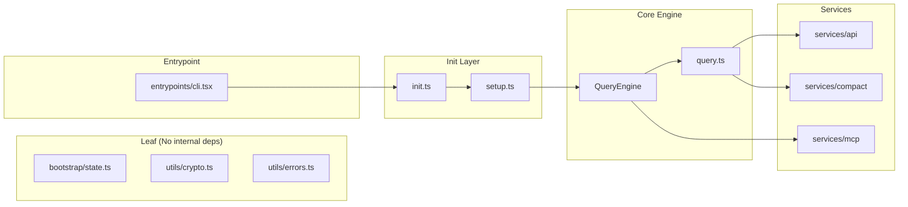

### 5.4 工具扩展

**Tool Registration Flow** (Mermaid):

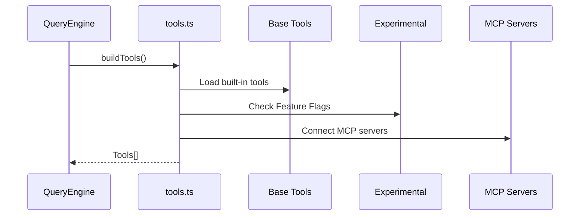

### 5.5 命令扩展

```typescript
// src/commands/commands.ts
const COMMANDS = memoize((): Command[] => [
  // Built-in commands
  help, exit, clear, compact, resume,
  // Git commands
  commit, branch, diff, review,
  // Config commands
  config, hooks, skills, permissions,
  // ... 80+ commands
])

// Command parsing
export function parseSlashCommand(input: string): Command | null {
  const match = input.match(/^\/(\w+)(?:\s+(.*))?$/)
  if (!match) return null
  return findCommand(match[1])
}
```

### 5.6 Hook 扩展

```typescript
// Hook configuration example
{
  "hooks": {
    "PreToolUse": [{
      "matcher": "Bash",
      "hooks": [{
        "type": "command",
        "if": "Bash(rm *)",
        "command": ".claude/hooks/block-rm.sh"
      }]
    }]
  }
}
```

---

## 6. 多 Agent 架构

### 6.1 多 Agent 架构总览（Mermaid）

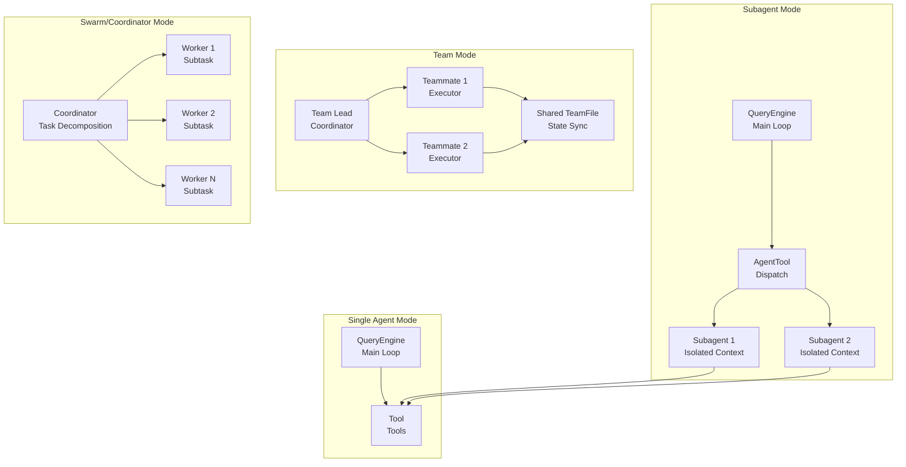

### 6.2 Subagent 实现

#### 6.2.1 Subagent 生命周期

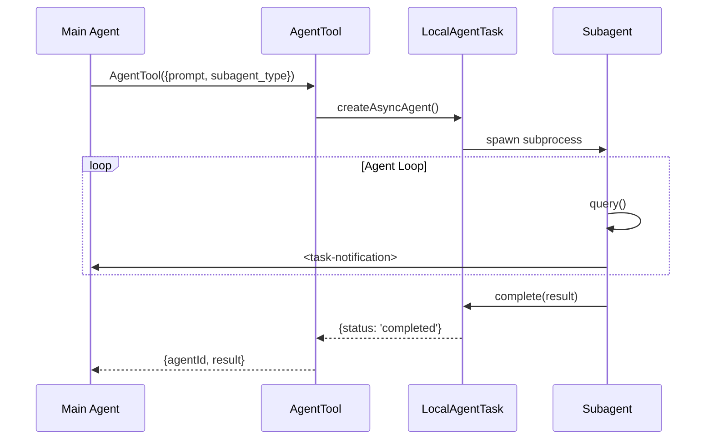

#### 6.2.2 AgentTool 核心实现

```typescript
// src/tools/AgentTool/AgentTool.tsx
export const AgentTool = buildTool({
  name: 'Agent',
  inputSchema: z.object({
    description: z.string().describe('Task description'),
    prompt: z.string().describe('Task content'),
    subagent_type: z.string().optional().describe('Agent type'),
    run_in_background: z.boolean().optional(),
  }),

  async call(input, context) {
    // 1. Create async task
    const taskId = await createAsyncAgent({
      prompt: input.prompt,
      agentType: input.subagent_type || 'general-purpose',
    })

    // 2. Return task ID (for background run)
    if (input.run_in_background) {
      return { status: 'async_launched', agentId: taskId }
    }

    // 3. Wait for completion (sync mode)
    const result = await waitForAgent(taskId)
    return { status: 'completed', ...result }
  },
})
```

#### 6.2.3 工具白名单

```typescript
// Worker can only use limited tools
const WORKER_TOOLS = ['Bash', 'Read', 'Edit']

export function getAllowedToolsForAgent(agentType: string): string[] {
  if (agentType === 'worker') {
    return WORKER_TOOLS
  }
  return ALL_TOOLS  // coordinator can use everything
}
```

### 6.3 Team 模式实现

#### 6.3.1 Team 创建流程

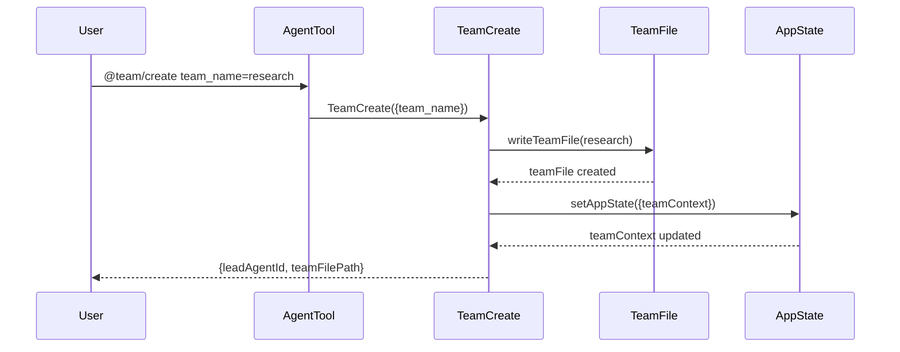

#### 6.3.2 TeamCreateTool 实现

```typescript
// src/tools/TeamCreateTool/TeamCreateTool.ts
export const TeamCreateTool = buildTool({
  name: 'TeamCreate',

  async call(input, context) {
    const { team_name, description, agent_type } = input

    // 1. Generate unique team name
    const finalTeamName = generateUniqueTeamName(team_name)

    // 2. Create TeamFile
    const teamFile: TeamFile = {
      name: finalTeamName,
      leadAgentId: formatAgentId(TEAM_LEAD_NAME, finalTeamName),
      members: [{ agentId, name: TEAM_LEAD_NAME, ... }],
    }

    // 3. Write to disk
    await writeTeamFileAsync(finalTeamName, teamFile)

    // 4. Update AppState
    setAppState(prev => ({
      ...prev,
      teamContext: { teamName: finalTeamName, teammates: {...} },
    }))

    return { team_name: finalTeamName, team_file_path, lead_agent_id }
  },
})
```

### 6.4 Coordinator 模式

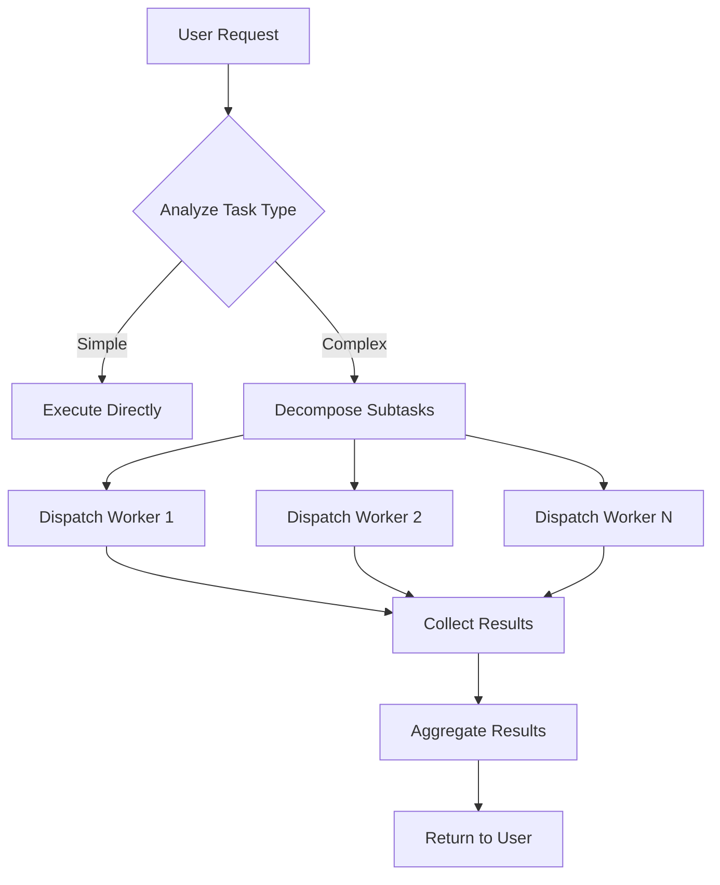

```typescript
// Coordinator system prompt
export function getCoordinatorPrompt(): string {
  return `You are the coordinator of a multi-agent team.
When given a complex task:
1. Analyze if it can be parallelized
2. Break into subtasks
3. Dispatch to workers with clear instructions
4. Aggregate results
5. Present unified response`
}
```

### 6.5 Agent 类型总览

| Type | Purpose | Tool Permission | Context |
|------|---------|----------------|---------|
| `general-purpose` | General tasks | All | Main session |
| `Bash` | Execute commands | Bash-only | New |
| `Explore` | Code exploration | Read/Grep/Glob | New |
| `Plan` | Make plans | Limited | Main session |
| `Worker` | Subtask execution | Whitelist | Isolated |
| `Team Lead` | Team coordination | All | Team shared |

---

## 7. 核心模块深度分析

### 7.1 query.ts 核心循环

#### query() 完整实现

```typescript
export async function* query(
  params: QueryParams,
): AsyncGenerator<StreamEvent | Message> {
  const consumedCommandUuids: string[] = []
  const terminal = yield* queryLoop(params, consumedCommandUuids)
  for (const uuid of consumedCommandUuids) {
    notifyCommandLifecycle(uuid, 'completed')
  }
  return terminal
}
```

#### queryLoop() while 循环逻辑

```typescript
async function* queryLoop(params: QueryParams, ...): AsyncGenerator<...> {
  let state: State = {
    messages: params.messages,
    toolUseContext: params.toolUseContext,
    turnCount: 1,
  }

  while (true) {
    // 1. Pre-check: snip, microcompact, autocompact
    // 2. Call API: deps.callModel()
    // 3. Tool execution: runTools()
    // 4. State update + continue / return
  }
}
```

#### 循环退出路径

| Exit | Meaning |
|------|---------|
| `{ reason: 'completed' }` | Normal completion |
| `{ reason: 'aborted_streaming' }` | User interrupted |
| `{ reason: 'prompt_too_long' }` | Context overflow |
| `{ reason: 'max_turns', turnCount }` | Max turns reached |

### 7.2 Tool.ts 工具基类

```typescript
// src/Tool.ts
const TOOL_DEFAULTS = {
  isEnabled: () => true,
  isConcurrencySafe: () => false,
  isReadOnly: () => false,
  isDestructive: () => false,
  checkPermissions: () => ({ behavior: 'allow' }),
  toAutoClassifierInput: () => '',
}

export function buildTool<D extends ToolDef>(def: D): Tool {
  return { ...TOOL_DEFAULTS, userFacingName: () => def.name, ...def }
}
```

### 7.3 state/store.ts 极简 Store

```typescript
export function createStore<T>(initialState: T, onChange?) {
  let state = initialState
  const listeners = new Set<Listener>()

  return {
    getState: () => state,
    setState: (updater) => {
      const prev = state
      const next = updater(prev)
      if (Object.is(next, prev)) return  // Skip if unchanged
      state = next
      onChange?.({ newState: next, oldState: prev })
      for (const listener of listeners) listener()
    },
    subscribe: (listener) => {
      listeners.add(listener)
      return () => listeners.delete(listener)
    },
  }
}
```

### 7.4 services/compact/ 上下文压缩

**Circuit Breaker**:

```typescript
const MAX_CONSECUTIVE_FAILURES = 3

export async function autoCompact(params: QueryParams): Promise<boolean> {
  if (tracking.consecutiveFailures >= MAX_CONSECUTIVE_FAILURES) {
    return false  // Stop retrying
  }

  try {
    await compactMessages(params)
    tracking.consecutiveFailures = 0
    return true
  } catch (error) {
    tracking.consecutiveFailures++
    return false
  }
}
```

---

## 8. 其他工程经验

### 8.1 快速路径优化

```typescript
// src/entrypoints/cli.tsx
async function main(): Promise<void> {
  const args = process.argv.slice(2)

  // Zero-import version check
  if (args.length === 1 && (args[0] === '--version')) {
    console.log(`${MACRO.VERSION} (Claude Code)`)
    return
  }

  // Only load full module for other commands
  const { cliMain } = await import('./main.js')
  return cliMain()
}
```

### 8.2 Feature Flag + DCE

```typescript
import { feature } from 'bun:bundle'

// Compile-time elimination
if (feature('COORDINATOR_MODE')) {
  require('./coordinatorMode.js')
}
```

### 8.3 Circuit Breaker

```typescript
const MAX_CONSECUTIVE_FAILURES = 3

// Stop retrying after N failures
if (tracking.failures >= MAX_CONSECUTIVE_FAILURES) {
  return { wasCompacted: false }
}
```

---

## Summary

### Core Design Patterns

| Pattern | Description |
|---------|-------------|
| **Fast Path Optimization** | Zero-import `--version`, dynamic `import()` |
| **Feature Flag + DCE** | `feature('FLAG')` compile-time elimination |
| **Simple Store** | 30 lines, `Object.is` + `Set` |
| **Tool Plugin System** | `Tool` base class + `buildTool()` factory |
| **Hook Injection** | Permission logic replaceable, 4-layer decision |
| **AsyncGenerator Streaming** | `yield*` delegation for streaming |
| **Dependency Injection** | Core logic separated from implementation |
| **Coordinator Mode** | Multi-Agent orchestration via system prompt |
| **Circuit Breaker** | Stop retry after N consecutive failures |
| **Context Compression** | Auto threshold trigger + circuit breaker |

### Core Principles

1. **Performance First**: Fast path, lazy loading, DCE
2. **Simplicity**: Solve problems with minimum code (30-line Store vs 100+ Redux)
3. **Extensibility**: Plugin-based, Hook injection, Feature Flags
4. **Testability**: Dependency injection, modularity
