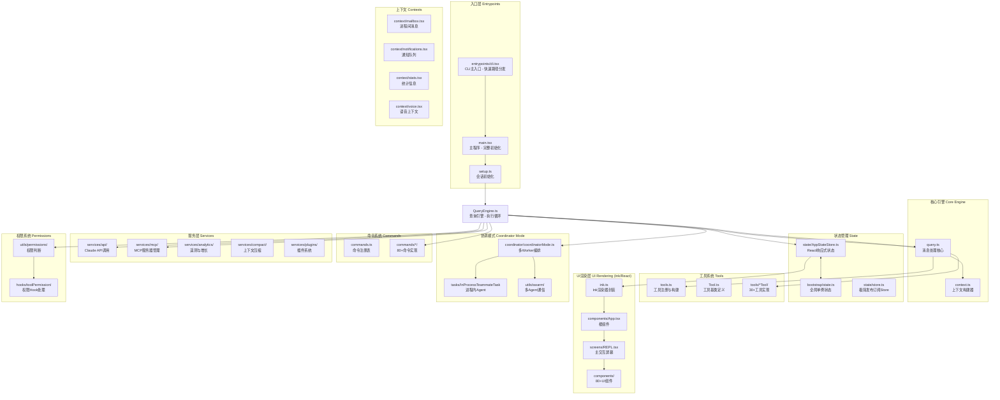

# Claude Code 代码库架构分析报告

> 分析日期：2026-03-31  
> 源码目录：restored-src/src

---

## 1. 代码架构图

```
┌─────────────────────────────────────────────────────────────┐
│                        入口层                                │
│  cli.tsx (快速路径) → main.tsx (全量初始化) → setup.ts    │
└──────────────────────────┬──────────────────────────────────┘
                           ↓
┌─────────────────────────────────────────────────────────────┐
│                       核心引擎                               │
│  QueryEngine (执行循环) → query.ts (消息处理) → context.ts │
└──────────────────────────┬──────────────────────────────────┘
                           ↓
        ┌─────────────────┼─────────────────┐
        ↓                 ↓                 ↓
┌──────────────┐  ┌──────────────┐  ┌──────────────┐
│   状态层      │  │   工具层      │  │   命令层      │
│ store.ts     │  │ Tool.ts      │  │ commands.ts  │
│ AppStateStore│  │ 30+工具实现   │  │ 80+命令实现   │
└──────────────┘  └──────────────┘  └──────────────┘
        ↓
┌─────────────────────────────────────────────────────────────┐
│                       UI 渲染层                             │
│  Ink (React终端) → App.tsx → REPL.tsx → 80+组件            │
└─────────────────────────────────────────────────────────────┘
```

### Mermaid 版本



---

## 2. 核心设计理念

### 2.1 分层架构

Claude Code 采用**分层+模块化**架构，从上到下：

- **入口层**：`cli.tsx` 做快速路径分流，避免不必要的模块加载
- **核心引擎**：`QueryEngine` 驱动主循环，`query.ts` 处理消息
- **状态层**：双轨状态（全局单例 `state.ts` + React响应式 `AppStateStore`）
- **UI层**：Ink（React的终端实现）+ 自研组件库
- **工具/命令层**：插件化设计，工具和命令独立注册

### 2.2 快速路径优化

`cli.tsx` 的核心思想——**零导入快速路径**：

```
--version        → 直接输出版本号，无任何import
--daemon         → 动态import daemon模块
--bg/--background → 动态import bg.js
```

这使得基本命令（如 `--version`）启动极快。

### 2.3 Feature Flag 驱动的 DCE

使用 `feature('FLAG_NAME')` 从 `bun:bundle` 内联检查，实现**编译时消除**不需要的代码路径：

- `COORDINATOR_MODE` - 多Agent协调模式
- `KAIROS` - 助手模式
- `BRIDGE_MODE` - 远程控制模式
- `VOICE_MODE` - 语音模式
- `TEMPLATES` - 模板任务

### 2.4 权限系统架构

权限判断通过 **Hook 模式**注入到 `QueryEngine`，而非硬编码：

- `useCanUseTool.tsx` 是核心权限判断Hook
- 支持多种模式：Interactive、Coordinator、Swarm Worker、Bypass
- 每个工具执行前通过 `canUseTool` 函数判断

### 2.5 极简响应式 Store

```typescript
// state/store.ts - 约30行的发布订阅Store
export function createStore<T>(initialState: T, onChange?) {
  let state = initialState
  const listeners = new Set<Listener>()
  return {
    getState: () => state,
    setState: (updater) => { /* 更新 + 通知 */ },
    subscribe: (listener) => { /* 返回取消订阅 */ }
  }
}
```

整个应用围绕这个模式构建，所有状态变更都通过 `setState`。

### 2.6 Coordinator 模式（多Agent编排）

当 `COORDINATOR_MODE` 开启时：

- 主Agent扮演**协调者**角色
- 通过 `AgentTool` 派发 `worker` 子Agent
- 子Agent的结果通过 `<task-notification>` XML标签异步返回
- 协调者负责任务分解、结果聚合、用户通信

---

## 3. 从启动到执行命令的完整链路

```
1. 用户执行 `claude` 命令
   └─> entrypoints/cli.tsx:main()
       ├─> --version → 直接打印版本（零导入）
       └─> 其他命令 → 动态import main.tsx

2. main.tsx 初始化（模块导入阶段 ~135ms）
   ├─> profileCheckpoint('main_tsx_entry')
   ├─> startMdmRawRead() - MDM配置并行读取
   ├─> startKeychainPrefetch() - Keychain并行预读
   └─> 导入大量模块（免疫分析、配置、API等）

3. init() 函数（enableConfigs + 环境准备）
   ├─> applySafeConfigEnvironmentVariables()
   ├─> applyExtraCACertsFromConfig()
   ├─> waitForPolicyLimitsToLoad()
   └─> waitForRemoteManagedSettingsToLoad()

4. setup() 函数（会话初始化）
   ├─> findCanonicalGitRoot() - 定位项目根目录
   ├─> captureHooksConfigSnapshot() - 快照钩子配置
   ├─> initializeFileChangedWatcher() - 初始化文件监控
   ├─> startUdsMessaging() - 进程间UDS通信
   └─> captureTeammateModeSnapshot() - Swarm快照

5. getCommands() - 挂载所有命令到Commander

6. 渲染Ink TUI
   └─> launchRepl(root, appProps, replProps)
       └─> App > REPL 组件树

7. 用户输入 → processUserInput()
   ├─> 解析斜杠命令 (/help, /commit等)
   ├─> 解析 @agent 提及
   ├─> 处理附件（图片、文件）
   └─> 返回消息数组 + shouldQuery标志

8. QueryEngine.handleNextMessage()
   ├─> 追加消息到历史
   ├─> 检查是否需要compact
   ├─> 构建system prompt
   ├─> 调用Claude API (withRetry)
   ├─> 解析tool_use块
   └─> 循环执行直到完成

9. 工具执行循环
   for each tool_use:
       ├─> canUseTool() → 权限检查
       ├─> tool.description() → 获取描述
       ├─> tool.validate() → 参数校验
       ├─> tool.execute() → 执行
       └─> 追加tool_result消息

10. Compact（上下文压缩）
    ├─> calculateTokenWarningState()
    ├─> buildPostCompactMessages()
    └─> 替换对话历史为摘要
```

---

## 4. 核心设计模式

| 模式 | 应用位置 | 说明 |
|------|----------|------|
| **Feature Flag + DCE** | `feature('FLAG')` | 编译时消除废弃代码 |
| **Fast Path Dispatch** | `cli.tsx` | 快速路径优先，避免不必要导入 |
| **Dependency Injection** | `useCanUseTool`, `QueryEngine` | 权限和处理函数注入 |
| **Pub/Sub Store** | `state/store.ts` | 极简响应式状态管理 |
| **Context + Reducer** | `AppStateStore.ts` | React的setState驱动UI更新 |
| **Command Registry** | `commands.ts` | 动态命令加载和注册 |
| **Tool Registry** | `tools.ts` | 工具的集中注册和构建 |
| **Worker Pool** | `coordinatorMode.ts` | 多Agent任务派发和协调 |
| **Async Iterator** | `query.ts` 流式处理 | API流式响应处理 |

---

## 5. 关键文件速查

| 文件 | 职责 |
|------|------|
| `entrypoints/cli.tsx` | CLI主入口，版本检查，快速路径分发 |
| `main.tsx` | 主程序，全量模块导入和初始化编排 |
| `setup.ts` | 会话初始化（Git根目录、Hooks、Worktree） |
| `state/store.ts` | 核心响应式Store实现 |
| `state/AppStateStore.ts` | App级别状态类型定义 |
| `QueryEngine.ts` | 查询执行引擎，主消息循环 |
| `query.ts` | processUserInput + API调用 + 工具循环 |
| `context.ts` | System/User Context构建器 |
| `commands.ts` | 80+命令的注册表 |
| `tools.ts` | 30+工具的注册表 |
| `Tool.ts` | 工具基类，定义execute/description/validate |
| `components/App.tsx` | React根组件，Provider组合 |
| `screens/REPL.tsx` | 主交互界面（4926行庞然大物） |
| `coordinator/coordinatorMode.ts` | 多Agent协调模式 |
| `hooks/useCanUseTool.tsx` | 权限判断Hook |
| `context/notifications.tsx` | 通知队列管理 |
| `services/compact/` | 上下文压缩服务 |
| `services/mcp/` | MCP服务器管理 |
| `utils/messages.ts` | 消息构建工具函数 |

---

## 6. 核心目录结构

```
src/
├── entrypoints/          # 程序入口点
│   ├── cli.tsx          # CLI快速路径分发
│   ├── init.ts          # 初始化函数
│   └── sdk/             # Agent SDK类型
├── bootstrap/           # 启动状态
│   └── state.ts         # 全局单例状态
├── coordinator/         # 协调模式
│   └── coordinatorMode.ts
├── commands/            # 80+命令实现
│   ├── help/
│   ├── commit.ts
│   ├── review.ts
│   └── ...
├── tools/              # 30+工具实现
│   ├── BashTool/
│   ├── AgentTool/
│   ├── FileEditTool/
│   └── ...
├── state/              # React状态管理
│   ├── store.ts        # 极简Store
│   └── AppStateStore.ts
├── context/            # React Context
│   ├── mailbox.tsx     # 进程间消息
│   └── notifications.tsx
├── components/        # 80+UI组件
│   ├── App.tsx
│   ├── PromptInput/
│   ├── permissions/
│   └── ...
├── screens/            # 顶层屏幕
│   └── REPL.tsx       # 主交互界面
├── services/          # 后台服务
│   ├── api/           # Claude API
│   ├── compact/       # 上下文压缩
│   └── mcp/           # MCP服务器
├── hooks/             # React Hooks
│   └── useCanUseTool.tsx
├── utils/             # 工具函数
│   ├── messages.ts
│   ├── permissions/
│   └── ...
└── ink/               # Ink渲染器
    ├── root.ts
    ├── components/
    └── hooks/
```

---

## 7. 模块详解

### 7.1 入口层 (entrypoints/)

**核心文件**: `cli.tsx`

职责：
- 程序主入口点
- 快速路径分发：处理 `--version`、`--daemon`、`--bg` 等命令
- 版本信息输出

关键代码模式：
```typescript
// 零导入快速路径
if (process.argv.includes('--version')) {
  console.log(version)
  process.exit(0)
}
```

### 7.2 核心引擎 (QueryEngine, query.ts)

**QueryEngine** 是整个应用的核心驱动引擎，负责：
- 管理消息循环
- 调用 Claude API
- 执行工具循环
- 处理上下文压缩

**query.ts** 负责：
- 用户输入处理 (`processUserInput`)
- API 调用封装
- 工具执行循环

### 7.3 状态管理 (state/)

**store.ts** - 约 30 行的极简发布订阅 Store：
- `getState()` - 获取当前状态
- `setState(updater)` - 更新状态并通知所有监听者
- `subscribe(listener)` - 订阅状态变化，返回取消订阅函数

**AppStateStore.ts** - React 响应式状态：
- 基于 `store.ts` 构建
- 提供类型安全的状态操作
- 驱动 React UI 更新

### 7.4 命令系统 (commands/)

80+ 命令，包括：
- `/help` - 帮助命令
- `/commit` - Git 提交
- `/review` - 代码审查
- `/model` - 模型切换
- 等等...

命令注册表 (`commands.ts`) 统一管理所有命令的注册和执行。

### 7.5 工具系统 (tools/)

30+ 工具，包括：
- `BashTool` - 执行 Bash 命令
- `AgentTool` - 派发子 Agent（Coordinator 模式核心）
- `FileEditTool` - 文件编辑
- `GrepTool` - 代码搜索
- `WebFetchTool` - 网页获取
- 等等...

工具基类定义：
```typescript
class Tool {
  description(): string    // 工具描述
  validate(params): void   // 参数校验
  execute(params): Promise<Result>  // 执行
}
```

### 7.6 UI 渲染层 (Ink + React)

**Ink** 是 React 的终端实现，允许使用 React 组件构建 TUI。

**组件树**：
```
App
└── REPL
    ├── Header
    ├── Messages
    ├── PromptInput
    ├── Permissions
    └── ...
```

### 7.7 协调模式 (coordinator/)

**Coordinator Mode** 是 Claude Code 的多 Agent 编排机制：

- 主 Agent 扮演协调者角色
- 通过 `AgentTool` 派发 worker 子 Agent
- 子 Agent 结果通过 `<task-notification>` 异步返回
- 支持 Swarm 模式的多 Agent 协作

### 7.8 服务层 (services/)

| 服务 | 职责 |
|------|------|
| `api/` | Claude API 调用、重试、流式处理 |
| `compact/` | 上下文压缩，当 token 超限时压缩对话历史 |
| `mcp/` | MCP (Model Context Protocol) 服务器管理 |
| `analytics/` | 遥测和增长分析 |
| `plugins/` | 插件系统 |

---

## 8. 技术栈

| 类别 | 技术 |
|------|------|
| **运行时** | Bun |
| **UI** | Ink (React for Terminal) |
| **状态** | 自研 Pub/Sub Store + React Hooks |
| **CLI** | Commander.js |
| **API** | Claude API (流式) |
| **协议** | MCP (Model Context Protocol) |
| **测试** | 测试框架 |

---

## 9. 值得借鉴的设计经验

### 9.1 快速路径优化 (Fast Path Optimization)

**cli.tsx 的零导入快速路径**：

```typescript
async function main(): Promise<void> {
  const args = process.argv.slice(2);

  // Fast-path for --version: zero module loading needed
  if (args.length === 1 && (args[0] === '--version' || args[0] === '-v')) {
    console.log(`${MACRO.VERSION} (Claude Code)`);
    return;  // 直接返回，不加载任何模块
  }

  // 其他命令才加载完整模块
  const { profileCheckpoint } = await import('../utils/startupProfiler.js');
  // ...
}
```

**借鉴意义**：
- 基本命令（`--version`, `--help`）不需要加载任何业务模块
- 使用动态 `import()` 延迟加载，非必要不导入
- 减少 CLI 启动时间，提升用户体验

---

### 9.2 极简响应式 Store（约 30 行）

**state/store.ts**：

```typescript
type Listener = () => void

export function createStore<T>(initialState: T, onChange?) {
  let state = initialState
  const listeners = new Set<Listener>()  // Set 自动去重

  return {
    getState: () => state,

    setState: (updater) => {
      const prev = state
      const next = updater(prev)
      if (Object.is(next, prev)) return  // 新旧相同则跳过，避免无效渲染
      state = next
      onChange?.({ newState: next, oldState: prev })
      for (const listener of listeners) listener()
    },

    subscribe: (listener) => {
      listeners.add(listener)
      return () => listeners.delete(listener)  // 返回取消订阅函数
    },
  }
}
```

**借鉴意义**：
- 使用 `Object.is()` 检查状态变化，避免无效更新
- `Set` 存储 listeners，自动去重
- 返回取消订阅函数，内存安全
- 约 30 行实现完整的响应式模式，比 Redux 简洁得多

---

### 9.3 Feature Flag + DCE

**编译时消除不需要的代码**：

```typescript
// 方式 1：条件导入（编译时消除）
const SleepTool = feature('PROACTIVE') || feature('KAIROS')
  ? require('./tools/SleepTool/SleepTool.js').SleepTool
  : null

// 方式 2：feature() 内联检查
if (feature('COORDINATOR_MODE')) {
  // 只有开启 COORDINATOR_MODE 才加载
}

// 方式 3：环境变量 + 类型守卫
const cronTools = feature('AGENT_TRIGGERS')
  ? [CronCreateTool, CronDeleteTool, CronListTool]
  : []
```

**借鉴意义**：
- `feature('FLAG_NAME')` 从 `bun:bundle` 内联检查
- 未启用的功能完全不会进入产物
- 支持动态开启/关闭功能
- 常见 Flags：`COORDINATOR_MODE`, `VOICE_MODE`, `KAIROS`, `BG_SESSIONS`

---

### 9.4 工具系统的插件化设计

**Tool.ts 的工具基类**：

```typescript
export type Tool<Input, Output, P> = {
  // 核心方法
  call(args, context, canUseTool, parentMessage, onProgress?): Promise<ToolResult<Output>>
  description(input, options): Promise<string>

  // 必填字段
  readonly name: string
  readonly inputSchema: Input

  // 可选方法（有默认值）
  isEnabled(): boolean                    // 默认 true
  isConcurrencySafe(input): boolean       // 默认 false
  isReadOnly(input): boolean              // 默认 false
  isDestructive(input): boolean          // 默认 false
  checkPermissions(input, context)        // 默认 allow
  userFacingName(input): string           // 默认 name
}

// 工具构建器，自动填充默认值
export function buildTool<D extends ToolDef>(def: D): BuiltTool<D> {
  return {
    ...TOOL_DEFAULTS,        // 30 行默认实现
    userFacingName: () => def.name,
    ...def,
  }
}
```

**借鉴意义**：
- 所有工具有统一的接口（Tool 基类）
- `buildTool()` 工厂函数自动填充默认值
- 工具注册表（tools.ts）统一管理 30+ 工具
- 工具可以声明 `isConcurrencySafe` 控制并发安全

---

### 9.5 权限系统的 Hook 注入

**useCanUseTool.tsx**：

```typescript
// 权限检查函数类型
export type CanUseToolFn = (
  tool: Tool,
  input: Input,
  context: ToolUseContext,
  assistantMessage: AssistantMessage,
  toolUseID: string,
  forceDecision?: PermissionDecision
) => Promise<PermissionDecision>

// 注入到 QueryEngine，不是硬编码
const decisionPromise = forceDecision !== undefined
  ? Promise.resolve(forceDecision)
  : hasPermissionsToUseTool(tool, input, context, assistantMessage, toolUseID)
```

**借鉴意义**：
- 权限判断通过 Hook 注入，不是硬编码 if-else
- 支持多种模式：Interactive、Coordinator、Swarm Worker、Bypass
- 每个工具执行前通过 `canUseTool` 函数判断
- 方便测试和扩展

---

### 9.6 AsyncGenerator 实现流式处理

**query.ts 的查询循环**：

```typescript
export async function* query(params: QueryParams): AsyncGenerator<
  | StreamEvent      // 流式事件
  | RequestStartEvent
  | Message
  | ToolUseSummaryMessage,
  Terminal           // 返回类型
> {
  const consumedCommandUuids: string[] = []
  const terminal = yield* queryLoop(params, consumedCommandUuids)
  return terminal
}

async function* queryLoop(params: QueryParams, ...) {
  // 主循环
  while (true) {
    const result = yield* api.call(params)  // yield* 流式调用
    // 处理结果...
    if (isTerminal(result)) break
  }
}
```

**借鉴意义**：
- 使用 `AsyncGenerator` 实现流式处理
- `yield*` 委托给子生成器，代码更清晰
- 支持增量输出（流式响应）
- 可以 `yield` 出中间状态（进度、错误等）

---

### 9.7 Coordinator 模式（多 Agent 编排）

**coordinatorMode.ts**：

```typescript
export function isCoordinatorMode(): boolean {
  if (feature('COORDINATOR_MODE')) {
    return isEnvTruthy(process.env.CLAUDE_CODE_COORDINATOR_MODE)
  }
  return false
}

// Worker 可用的工具
const workerTools = isEnvTruthy(process.env.CLAUDE_CODE_SIMPLE)
  ? [BASH_TOOL_NAME, FILE_READ_TOOL_NAME, FILE_EDIT_TOOL_NAME]
  : Array.from(ASYNC_AGENT_ALLOWED_TOOLS)
```

**借鉴意义**：
- 主 Agent 扮演协调者，通过 `AgentTool` 派发 worker
- 子 Agent 结果通过 `<task-notification>` 异步返回
- 支持任务分解、并行执行、结果聚合
- Coordinator 模式可以做得更复杂（Swarm 模式）

---

### 9.8 依赖注入 (Dependency Injection)

**query.ts 的 deps**：

```typescript
// 依赖通过参数传入，而非硬编码
export type QueryParams = {
  messages: Message[]
  systemPrompt: SystemPrompt
  userContext: { [k: string]: string }
  systemContext: { [k: string]: string }
  canUseTool: CanUseToolFn      // 注入
  toolUseContext: ToolUseContext // 注入
  deps?: QueryDeps              // 可选依赖
  // ...
}
```

**借鉴意义**：
- 核心逻辑不依赖具体实现，通过参数注入
- 方便测试时 mock 依赖
- `deps?: QueryDeps` 可选依赖，有默认值

---

### 9.9 ToolUseContext 的上下文传递

**Tool.ts 的上下文类型**：

```typescript
export type ToolUseContext = {
  options: {
    tools: Tools
    mcpClients: MCPServerConnection[]
    agentDefinitions: AgentDefinitionsResult
    maxBudgetUsd?: number
    refreshTools?: () => Tools
    // ...
  }
  abortController: AbortController
  getAppState(): AppState
  setAppState(f: (prev: AppState) => AppState): void
  setToolJSX?: SetToolJSXFn
  addNotification?: (notif: Notification) => void
  // ...
  messages: Message[]
}
```

**借鉴意义**：
- 所有上下文通过一个对象传递，避免参数爆炸
- 包含状态、操作、工具、消息等
- 工具执行时可以访问和修改上下文
- `setAppState` 支持函数式更新

---

### 9.10 消息规范化 (normalizeMessagesForAPI)

**utils/messages.ts**：

```typescript
export function normalizeMessagesForAPI(messages: Message[]): Message[] {
  // 1. 移除签名块
  // 2. 过滤重复附件
  // 3. 转换格式
  // 4. 返回标准化的消息数组
}
```

**借鉴意义**：
- 消息在发送到 API 前统一规范化
- 分离 Concerns：构建消息 vs 发送消息
- 方便后续添加新的消息类型

---

## 10. 总结

Claude Code 是一个设计精良的 CLI 应用，核心设计经验：

| 经验 | 说明 | 可借鉴场景 |
|------|------|-----------|
| **快速路径优化** | 零导入快速命令 | CLI 工具、性能敏感场景 |
| **极简 Store** | 30 行响应式实现 | 中小型应用状态管理 |
| **Feature Flag + DCE** | 编译时消除废弃代码 | 多环境、多租户 |
| **工具插件化** | 统一接口 + 工厂函数 | 工具系统、扩展机制 |
| **Hook 注入权限** | 权限逻辑可替换 | 安全敏感系统 |
| **AsyncGenerator 流式** | 增量处理 + 中间状态 | 流式 API、长任务 |
| **Coordinator 模式** | 多 Agent 编排 | 复杂任务分解 |
| **依赖注入** | 核心逻辑与实现分离 | 可测试性 |
| **上下文对象传递** | 避免参数爆炸 | 工具系统、插件系统 |

**核心原则**：
1. **性能优先**：快速路径、延迟加载、DCE
2. **简洁**：用最少的代码解决问题（30 行 Store vs 100 行 Redux）
3. **可扩展**：插件化、Hook 注入、Feature Flag
4. **可测试**：依赖注入、函数式更新、模块化
