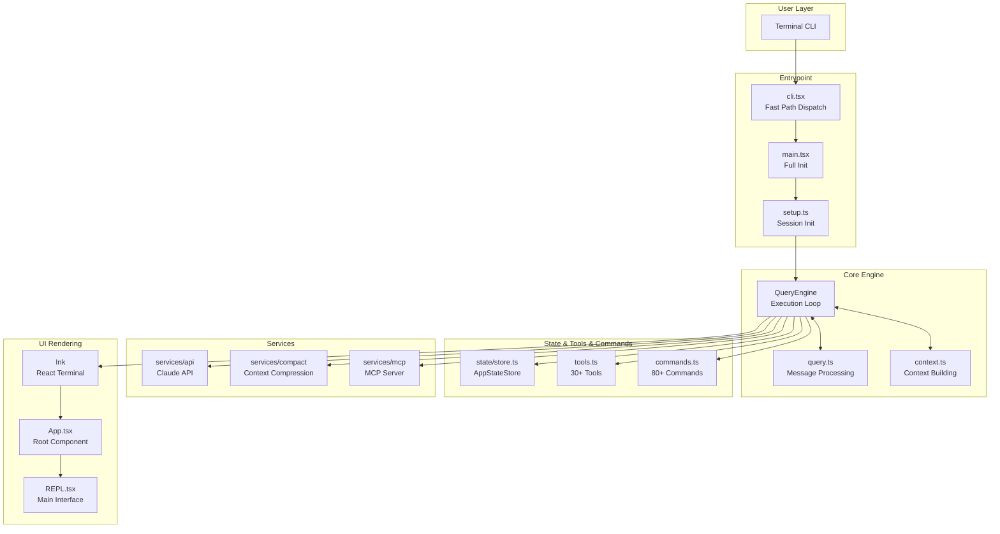

# 01 - 整体架构概览

> 本文档描述 Claude Code 的分层架构、技术选型和目录结构。

---

## 1. 分层架构



---

## 2. 技术选型

| Category | Technology | Purpose |
|----------|------------|---------|
| **Runtime** | Bun | Faster startup than Node |
| **UI** | Ink | React for terminal, build TUI with React |
| **State** | Custom Pub/Sub Store | ~30 lines, simpler than Redux |
| **CLI** | Commander.js | CLI argument parsing |
| **API** | Anthropic Claude API | LLM calls |
| **Protocol** | MCP | Model Context Protocol |
| **Type** | TypeScript + Zod | End-to-end type safety |

---

## 3. 目录结构

```
src/
├── entrypoints/              # Program entrypoints
│   ├── cli.tsx             # CLI fast path dispatch
│   ├── main.tsx            # Main program full init
│   └── init.ts             # Init functions
│
├── bootstrap/              # Bootstrap state
│   └── state.ts           # Global singleton state
│
├── coordinator/           # Coordinator mode
│   └── coordinatorMode.ts  # Multi-Agent coordination
│
├── query/                  # Query engine submodules
│   ├── deps.ts            # Dependency injection
│   └── transitions.ts      # State transitions
│
├── commands/              # Command system (80+)
│   └── commands.ts        # Command registry
│
├── tools/                 # Tool system (40+)
│   ├── tools.ts          # Tool registry
│   ├── Tool.ts          # Tool base class
│   ├── BashTool/        # Bash tool
│   ├── AgentTool/       # Agent dispatch tool
│   └── ...
│
├── state/                # State management
│   ├── store.ts        # Simple reactive Store (~30 lines)
│   └── AppStateStore.ts  # React state types
│
├── context/              # React Context
│   ├── mailbox.tsx     # Inter-process messaging
│   └── notifications.tsx # Notification queue
│
├── components/           # UI components (80+)
│   ├── App.tsx        # React root component
│   └── ...
│
├── screens/              # Top-level screens
│   └── REPL.tsx      # Main interface (4926 lines)
│
├── services/            # Backend services
│   ├── api/           # Claude API calls
│   ├── compact/       # Context compression
│   └── mcp/         # MCP server management
│
├── outputStyles/         # Output styles system
│   └── loadOutputStylesDir.ts  # Load custom styles
│
└── hooks/            # React Hooks
    └── useCanUseTool.tsx # Permission hook
```

---

## 4. 核心数据结构

### 4.1 全局状态 (bootstrap/state.ts)

```typescript
type State = {
  sessionId: SessionId
  parentSessionId: SessionId | undefined
  projectRoot: string
  cwd: string
  totalCostUSD: number
  totalAPIDuration: number
  totalToolDuration: number
  modelUsage: { [modelName: string]: ModelUsage }
  agentColorMap: Map<string, AgentColorName>
  mainThreadAgentType: string | undefined
  registeredHooks: Partial<Record<HookEvent, RegisteredHookMatcher[]>> | null
  invokedSkills: Map<string, InvokedSkillInfo>
  sessionCreatedTeams: Set<string>
  teamContext: TeamContext | undefined
  startTime: number
  lastInteractionTime: number
}
```

### 4.2 消息类型

```typescript
type Message =
  | { type: 'user'; content: Content; attachments: Attachment[] }
  | { type: 'assistant'; content: Content; thinking?: string }
  | { type: 'tool_use'; tool: string; input: object; id: string }
  | { type: 'tool_result'; tool_use_id: string; content: Content }
  | { type: 'summary'; content: string }
```

---

## 5. Feature Flag + DCE

Bun's compile-time dead code elimination:

```typescript
import { feature } from 'bun:bundle'

// Compile-time check, code only included if flag is enabled
if (feature('COORDINATOR_MODE')) {
  // Only included if COORDINATOR_MODE build flag is on
}

// Common Flags
const COORDINATOR_MODE = feature('COORDINATOR_MODE')  // Multi-Agent
const KAIROS = feature('KAIROS')                     // Assistant mode
const VOICE_MODE = feature('VOICE_MODE')              // Voice mode
const BG_SESSIONS = feature('BG_SESSIONS')           // Background sessions
```
