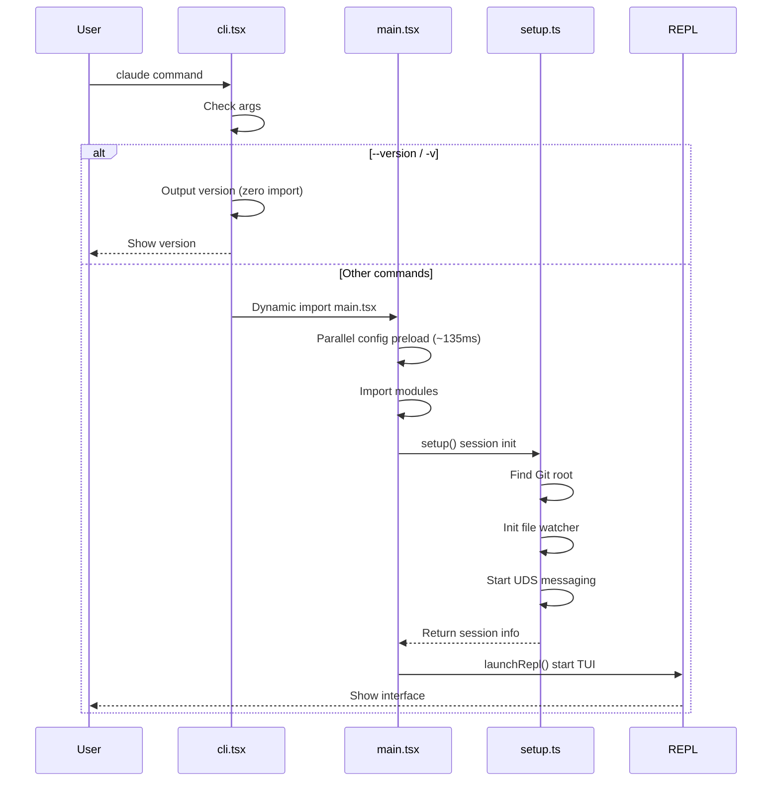
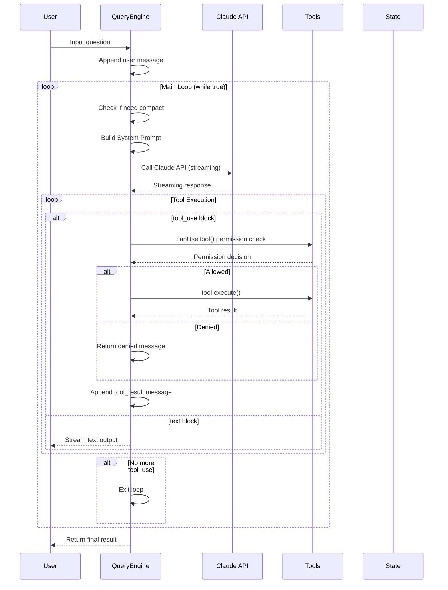
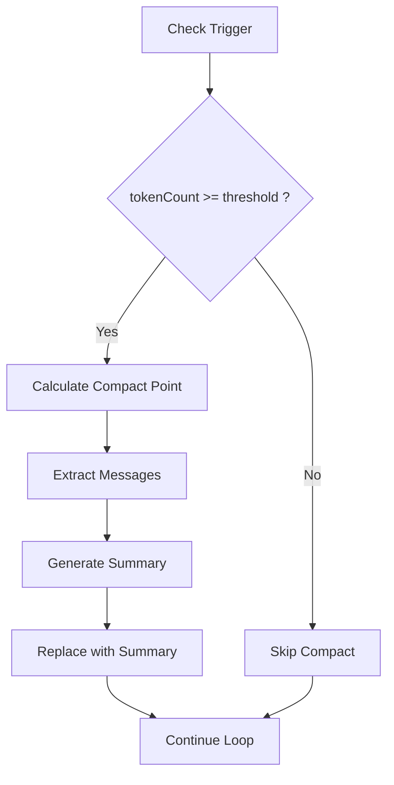

# 02 - 核心循环

> 本文档描述 Claude Code 的消息处理、工具调用和上下文压缩机制。

---

## 1. 启动流程



---

## 2. 查询执行流程



---

## 3. QueryEngine 核心实现

```typescript
export class QueryEngine {
  private tools: Tools;
  private messages: Message[] = [];
  private context: ToolUseContext;

  async *handleNextMessage(userInput: string): AsyncGenerator<Message | StreamEvent> {
    // 1. Append user message
    this.messages.push(createUserMessage(userInput));

    // 2. Main loop
    while (true) {
      const response = await this.callAPI(this.buildRequest());

      for (const block of response.content) {
        if (block.type === 'tool_use') {
          const result = await this.executeTool(block);
          this.messages.push(createToolResult(block.id, result));
        } else if (block.type === 'text') {
          yield createAssistantMessage(block.text);
        }
      }

      if (!response.hasMore) break;
    }
  }
}
```

---

## 4. query.ts 核心循环

### 4.1 query() 完整实现

```typescript
export async function* query(
  params: QueryParams,
): AsyncGenerator<StreamEvent | Message> {
  const consumedCommandUuids: string[] = []
  const terminal = yield* queryLoop(params, consumedCommandUuids)
  for (const uuid of consumedCommandUuids) {
    notifyCommandLifecycle(uuid, 'completed')
  }
  return terminal
}
```

### 4.2 queryLoop() while 循环逻辑

```typescript
async function* queryLoop(params: QueryParams, ...): AsyncGenerator<...> {
  let state: State = {
    messages: params.messages,
    toolUseContext: params.toolUseContext,
    turnCount: 1,
  }

  while (true) {
    // 1. Pre-check: snip, microcompact, autocompact
    // 2. Call API: deps.callModel()
    // 3. Tool execution: runTools()
    // 4. State update + continue / return
  }
}
```

### 4.3 循环退出路径

| Exit | Meaning |
|------|---------|
| `{ reason: 'completed' }` | Normal completion |
| `{ reason: 'aborted_streaming' }` | User interrupted |
| `{ reason: 'prompt_too_long' }` | Context overflow |
| `{ reason: 'max_turns', turnCount }` | Max turns reached |

---

## 5. 上下文压缩



### Circuit Breaker

```typescript
const MAX_CONSECUTIVE_FAILURES = 3

export async function autoCompact(params: QueryParams): Promise<boolean> {
  if (tracking.consecutiveFailures >= MAX_CONSECUTIVE_FAILURES) {
    return false  // Stop retrying
  }

  try {
    await compactMessages(params)
    tracking.consecutiveFailures = 0
    return true
  } catch (error) {
    tracking.consecutiveFailures++
    return false
  }
}
```

---

## 6. 极简 Store

```typescript
export function createStore<T>(initialState: T, onChange?) {
  let state = initialState
  const listeners = new Set<Listener>()

  return {
    getState: () => state,
    setState: (updater) => {
      const prev = state
      const next = updater(prev)
      if (Object.is(next, prev)) return  // Skip if unchanged
      state = next
      onChange?.({ newState: next, oldState: prev })
      for (const listener of listeners) listener()
    },
    subscribe: (listener) => {
      listeners.add(listener)
      return () => listeners.delete(listener)
    },
  }
}
```
